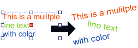

# Split text plug-in for Krita
This is a plugin for Krita, Select a multiple line text and split with line breaks.  
v0.7 — Compatible with Krita 5.2.14, 5.3.0, and 6.0.0  
v0.6 — Compatible with Krita 5.2.14 and 5.3.0  
v0.5 — Compatible with Krita 5.2.9 and 5.3.0  
v0.1 — Compatible with Krita 5.2.2–5.2.9

## About Split text plug-in for Krita

### About
This assist to speed up for typography  and graphic design work flow.  
It would useful for create MAP,Comic,Signboard,Diagram and Menu.

This type of functionality is in demand by professionals and amateurs alike.  
For example Known from Inkscape's extensions > text > Split text and Adobe illustrator scripts by 3rd parties.

### Usage
Select a text shape that has multiple lines and apply this.( In a VectorLayer )  
That OK  that contain different size,colors,or fonts style with Krita's text dialog setting.  

And,the text separated to individual single text shapes per each line break.  
(Of cause they are editable.)  
After then ,You only move the text to various place for layout freely.  

### How to setting shortcut action
If you want to set shortcut for this plug-in.  
At first,move "split_text.action" into action folder when install this  

1. Next, run Krita application.
2. Click "Keyboard shortcut" category in "Krita preferences dialog".
3. Type "split the text" in the seachbox of Shortcut setting.
4. You can found the shortcut setting of this,and choose "custom"
5. Push next to it for shortcut input.

### Limitation ( Use SVG for Krita Internal )
Support
* writing-mode : horizontal-tb, vertcal-rl, vertical-lr
* style attributes, transform (only rotation and translate)
* Line break by  &lt;tspan&gt; tag or \n

Not Support

* Line break by Auto text wrap in the area text 
* Line break by &lt;br&gt; tag 

## Update History
* 2026.02.17 Release v0.7 : 
    * Tested with Krita v5.3.0 and v6.0.0
    * Added a compatibility layer for PyQt5 and PyQt6 (qt_compat.py).  
    * This layer handles various API changes, including the transition from exec_() to exec(),   
    * updated enum types, event handling differences, and changes in the UI file loader.  

* 2025.10.18 Release v0.6 : 
    * Tested with Krita v5.2.14(PyQT5 with Python 3.13)
    * Preliminary PyQt6 compatibility added Updated import logic to support PyQt6 for future Krita 6.x compatibility.
    * Note: PyQt6 functionality has not been tested yet. This change is preparatory and not guaranteed to be stable.

* 2025.05.04 Release v0.5 : Support vertical text, transform of kirta text shape , plain text in Krita 5.3.0 and 5.2.9
* 2024.05.18 Release v0.1 : First release,it work only Krita 5.2.9 or earlier version
